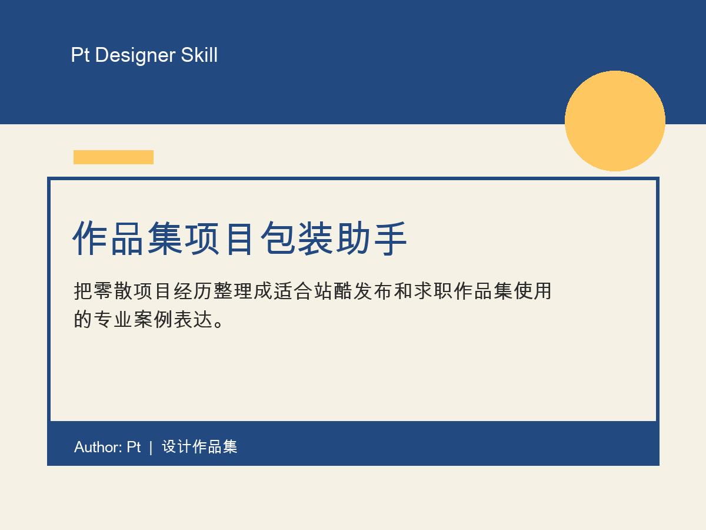

# 作品集项目包装助手

把零散项目经历整理成适合站酷发布和求职作品集使用的专业案例表达。

## 适合谁

UI 设计师、品牌设计师、视觉设计师、电商设计师、设计学生

## 适用场景

当你只有几张项目截图、几段零散说明，却需要把它整理成站酷作品或求职作品集时使用。

## 输入

项目名称、项目类型、行业/品牌/产品、目标用户、项目背景、设计目标、我的职责、已有素材、关键限制、最终结果、发布平台、希望语气

## 输出

一句话项目定位、作品标题建议、项目简介、案例结构、设计亮点、站酷发布文案、待补充清单

## 文件

- `SKILL.md`: skill 主体文件
- `demo.html`: 说明演示页
- `assets/cover.png`: 4:3 展示封面
- `LICENSE`: MIT License

## 作者

Author: Pt  
License: MIT
